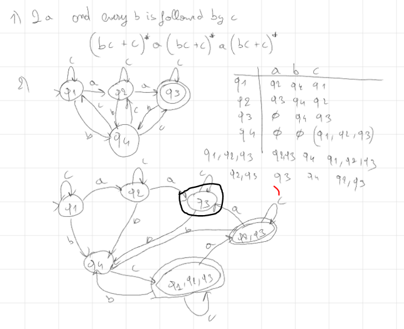

Question 1:
1-L* with L = {anb2n; n>=1}
S->A|SS
A->aAbb|epsilon

2- L= {anbmck; n=m or m<=k}

n = m : 
s1-> AB
A->aAb|epsilon  <-> this guarantees n =m
B->cB|epsilon

m<=k
S2->CD
C->aC|epsilon <-> no condition
D->bDc |E  <-> guarantess m = k
E -> cE|c  <-> adds at lest one c such that m<=k

and finally S->S1|S2

